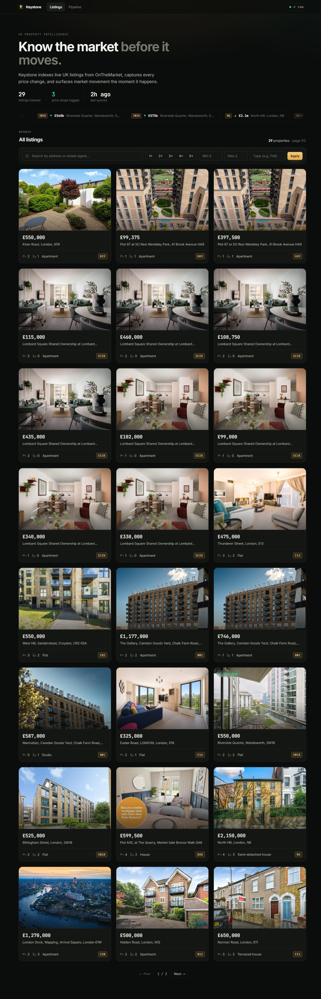
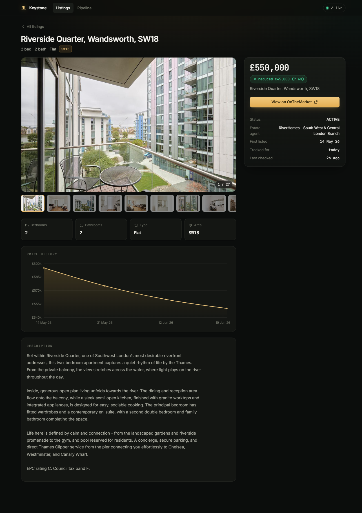
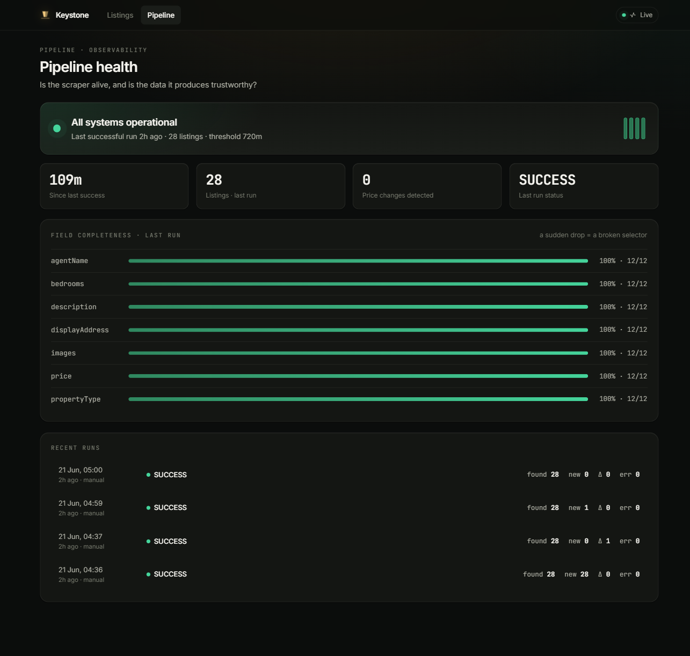
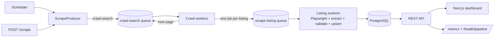

# UK Property Scraper & Monitoring

<!-- After pushing, replace OWNER with your GitHub username/org so this badge renders. -->


A production-shaped scraper for **[OnTheMarket](https://www.onthemarket.com/)** UK property listings, built as a pnpm/Turborepo monorepo:

- **Scraper + API** — NestJS workers that crawl search pages, fan out per-listing jobs through a BullMQ/Redis queue, render with Playwright, extract from the page's embedded JSON, validate, and store in PostgreSQL via Prisma.
- **Dashboard ("Keystone")** — a Next.js product UI with a landing hero, a **live price-movement ticker** built from real price-history data, listings with price-drop tags, an **immersive property page** (gallery + lightbox, price-history chart, market context), and a **pipeline-health console** (status hero, run-volume sparkline, animated data-completeness meters). Branded end-to-end: logo mark, favicon, generated Open Graph image, and per-listing page metadata.
- **Production document** — [`docs/production.md`](docs/production.md): how I'd scale it, track price changes, detect silent failures, monitor data quality and extraction accuracy, and alert.

For each listing it captures: **URL, address, asking price, property type, bedrooms, description, estate agent, and images** (plus bathrooms, postcode/outcode, and price history).

---

## Screenshots

| Listings | Listing detail + price history | Pipeline health |
|---|---|---|
|  |  |  |

---

## Architecture



**Why this shape?** Splitting *discovery* (crawl) from *extraction* (listing) behind a queue is what makes the production story real rather than theoretical — scaling is "add workers," and retries, rate limiting and back-pressure come for free. The same split is documented end-to-end in [`docs/production.md`](docs/production.md).

### Extraction strategy

OnTheMarket is a Next.js site that ships the full property object in `__NEXT_DATA__` (`props.initialReduxState.property`). The adapter reads that **structured** source first, and falls back to **OpenGraph meta tags** if it ever disappears (a site change). Each listing records which path produced it (`source: structured | fallback`) — a rising `fallback` ratio is an early warning that the extractor has drifted. Both paths are covered by tests against real captured pages.

---

## Tech stack

| Area | Choice |
|---|---|
| Language | TypeScript |
| Scraper / API | NestJS, BullMQ, Playwright, `@nestjs/schedule` |
| Queue / cache | Redis |
| Database / ORM | PostgreSQL, Prisma |
| Dashboard | Next.js (App Router), React, Recharts, Inter + JetBrains Mono |
| Validation | Zod |
| Tests | Jest (fixture-based, no network) |
| Tooling | pnpm workspaces, Turborepo, Docker Compose |

---

## Repository structure

```
uk-property-scraper/
├── apps/
│   ├── api/          # NestJS: REST API + queue workers + scheduler
│   └── web/          # Next.js dashboard
├── packages/
│   ├── core/         # types, Zod schema, OnTheMarket adapter, price logic (+ tests)
│   └── database/     # Prisma schema, client, seed
├── docs/
│   ├── production.md # Part 2: the production write-up
│   └── images/       # screenshots
└── docker-compose.yml
```

---

## Setup

### Prerequisites
- Node.js 20+ and **pnpm** (`npm i -g pnpm`)
- **Docker** (for Postgres + Redis)

### Steps

```bash
# 1. Install dependencies
pnpm install

# 2. Configure environment
cp .env.example .env

# 3. Start Postgres + Redis
docker compose up -d

# 4. Generate the Prisma client, build the libraries, and run migrations
pnpm db:generate
pnpm build
pnpm db:migrate

# 5. Install the Playwright browser (one-off)
pnpm --filter @ukps/api exec playwright install chromium
```

> **Note on the database port:** `.env.example` points Postgres at **`localhost:5433`** so it won't clash with a Postgres you may already run on `5432`. The Docker container maps `5433 -> 5432` to match.

### Run it

**Option A — dev servers (API + dashboard):**
```bash
pnpm dev
# API  -> http://localhost:3001
# Dashboard -> http://localhost:3000
```
Then trigger a scrape:
```bash
curl -X POST http://localhost:3001/scrape -H 'Content-Type: application/json' -d '{"location":"london","maxPages":1}'
```

**Option B — one-shot scrape (handy for demos/CI):**
```bash
pnpm scrape:once london 1     # location, max pages
```

**Optional — seed sample data** (works offline, includes a price drop):
```bash
pnpm --filter @ukps/database seed
```

---

## Sample output

A real listing as returned by `GET /listings/:id` (trimmed):

```json
{
  "portal": "ONTHEMARKET",
  "portalListingId": "18053674",
  "url": "https://www.onthemarket.com/details/18053674/",
  "displayAddress": "Riverside Quarter, Wandsworth, SW18",
  "outcode": "SW18",
  "postcode": "SW18 1FQ",
  "price": 550000,
  "currency": "GBP",
  "propertyType": "Flat",
  "bedrooms": 2,
  "bathrooms": 2,
  "agentName": "RiverHomes - South West & Central London Branch",
  "description": "Set within Riverside Quarter, one of Southwest London’s most desirable riverfront addresses, this two-bedroom apartment captures a quiet rhythm of life by the Thames...",
  "status": "ACTIVE",
  "imageCount": 27,
  "priceHistory": [{ "price": 550000, "changeType": "INITIAL" }]
}
```

A one-page London run, verified end-to-end:

```
Run SUCCESS — found=28 new=28 updated=0 priceChanges=0 errors=0
Field null-rates:  address 0%  price 0%  type 0%  bedrooms 0%  description 0%  agent 0%  images 0%
```
→ **28 properties, 673 images, 28 price-history rows**, 100% field completeness. Re-running after manually lowering one stored price produced `updated=28 priceChanges=1` and a new `INCREASE` history row for exactly that listing — proving idempotent upserts and price-change tracking.

---

## Database schema

```mermaid
erDiagram
    Property ||--o{ PropertyImage : has
    Property ||--o{ PriceHistory : has
    ScrapeRun ||--o{ FieldQualitySnapshot : has

    Property {
      string  id PK
      enum    portal
      string  portalListingId
      string  displayAddress
      string  outcode
      int     price "whole GBP, nullable (POA)"
      string  propertyType
      int     bedrooms
      string  description
      string  agentName
      enum    status "ACTIVE|SOLD_STC|REMOVED"
    }
    PropertyImage { string id PK; string propertyId FK; string url; int position }
    PriceHistory  { string id PK; string propertyId FK; int price; enum changeType "INITIAL|INCREASE|DECREASE"; datetime recordedAt }
    ScrapeRun     { string id PK; enum status; int listingsFound; int listingsNew; int priceChanges; int errorCount }
    FieldQualitySnapshot { string id PK; string runId FK; string field; int nullCount; float nullRate }
```

| Table | Purpose |
|---|---|
| `properties` | Canonical, de-duplicated listing. Upserted on `(portal, portalListingId)` so re-runs never duplicate. |
| `property_images` | Listing photos, ordered. |
| `price_history` | Append-only — **one row only when the price changes**. The spine of price tracking. |
| `scrape_runs` | Per-run heartbeat + counters. Drives silent-failure detection. |
| `field_quality_snapshots` | Per-run, per-field null rates. Drives data-quality monitoring. |

Full schema: [`packages/database/prisma/schema.prisma`](packages/database/prisma/schema.prisma).

---

## API reference

| Method | Endpoint | Description |
|---|---|---|
| `GET` | `/listings` | Filter by `minPrice,maxPrice,bedrooms,propertyType,outcode,status,q,page,pageSize` |
| `GET` | `/listings/:id` | One listing with images + price history |
| `GET` | `/listings/:id/price-history` | Price history series |
| `POST` | `/scrape` | Trigger a run `{ location?, maxPages? }` |
| `GET` | `/runs` | Recent scrape runs + field quality |
| `GET` | `/health` | Liveness |
| `GET` | `/health/pipeline` | Last successful run age + throughput (for a dead-man's switch) |
| `GET` | `/metrics` | Prometheus exposition (counts, null-rates) |

---

## Testing

```bash
pnpm test
```

Tests run against **real OnTheMarket pages captured as fixtures** (no network), and cover: the structured extractor (every required field), the OG-meta fallback path, Zod validation and sanity bounds, price-change logic, and the parsing utilities.

---

## Production write-up

The full Part 2 document — scaling, price tracking, silent-failure detection, data-quality and extraction-accuracy monitoring, and alerting, with diagrams — is in **[`docs/production.md`](docs/production.md)**.

## Known limitations (and where I'd take it next)

Called out deliberately — these are scoped choices, not oversights:

- **Listing status transitions are not yet automated.** `status` (`ACTIVE/SOLD_STC/REMOVED`) exists, and `lastSeenAt` is updated on every scrape, so staleness is *observable* today. Flipping a listing to `REMOVED` when it disappears from results needs per-run set-diffing (planned in [`docs/production.md` §1](docs/production.md)); for now a not-seen-in-N-days sweep is the intended mechanism.
- **One portal is implemented (OnTheMarket).** Rightmove/Zoopla are unimplemented `PortalAdapter`s — the interface and registry already exist, so adding one is implementing a single class.
- **`/metrics` is derived from the database**, not in-process counters. It's correct and demonstrable; a real deployment would back it with `prom-client` for rates/histograms.

## Responsible scraping

This project targets **public** listing data, applies conservative rate limits and human-like pacing, detects and backs off from anti-bot challenges (rather than hammering them), and supports proxy rotation via env. In any real deployment, respect the portal's `robots.txt` and terms of service and keep request rates considerate.
