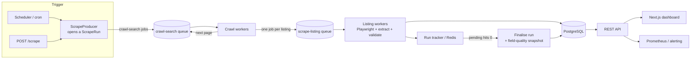
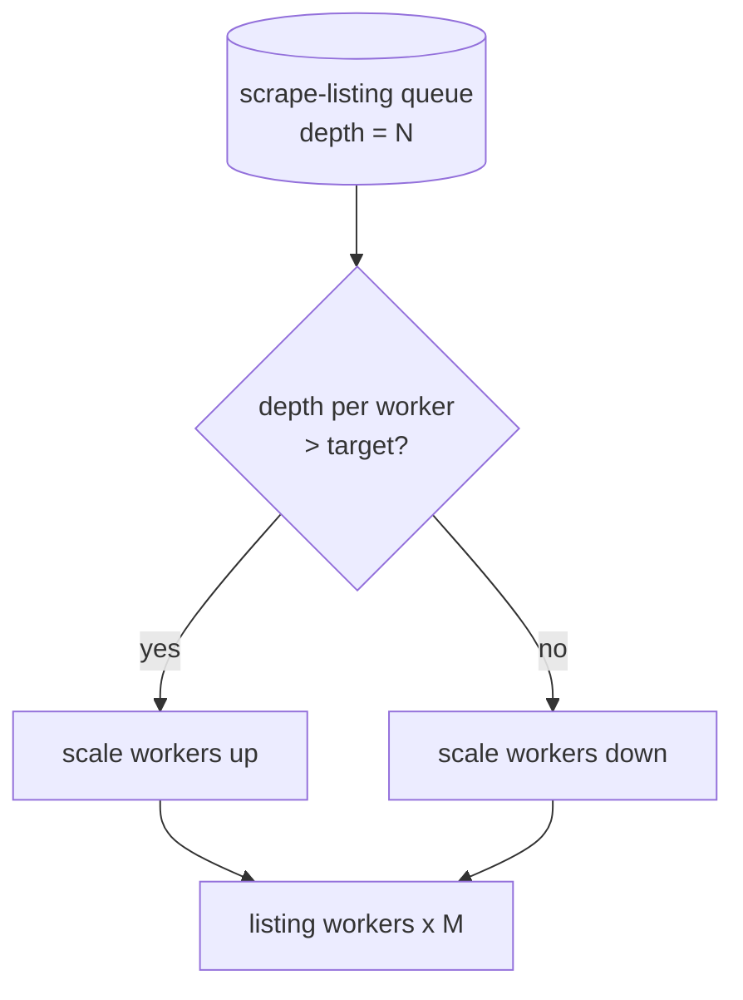
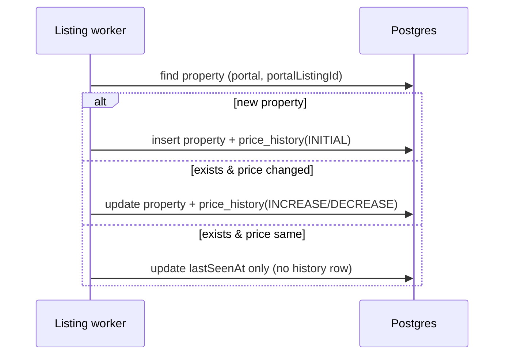
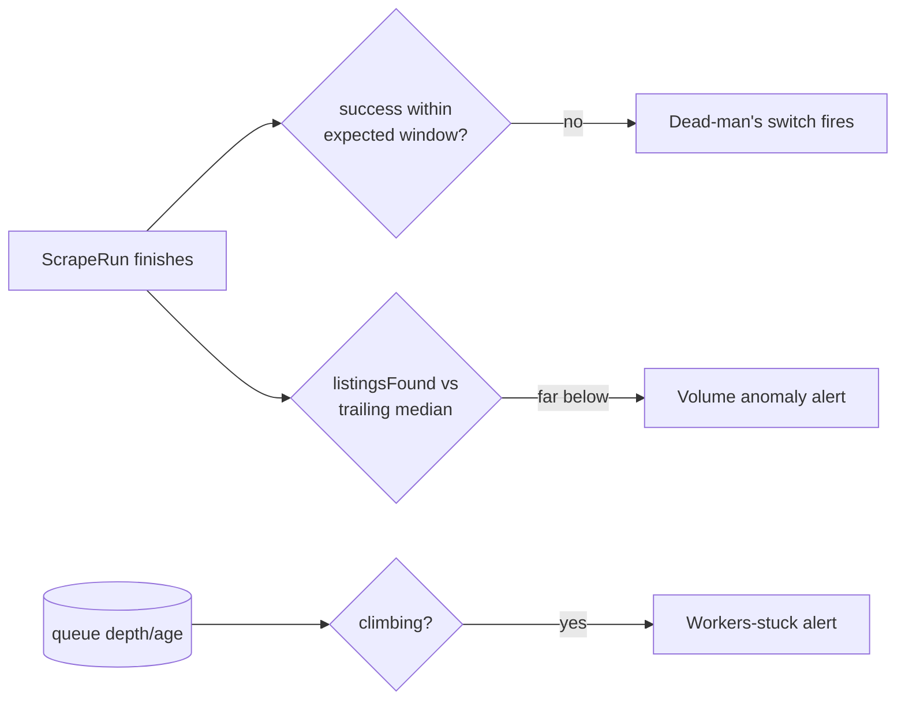
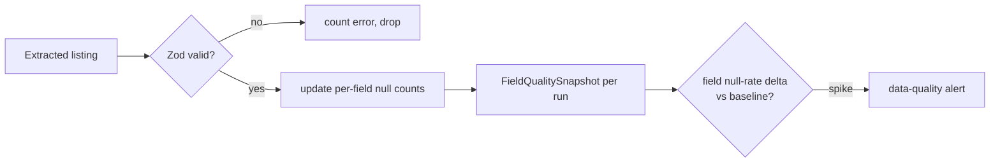
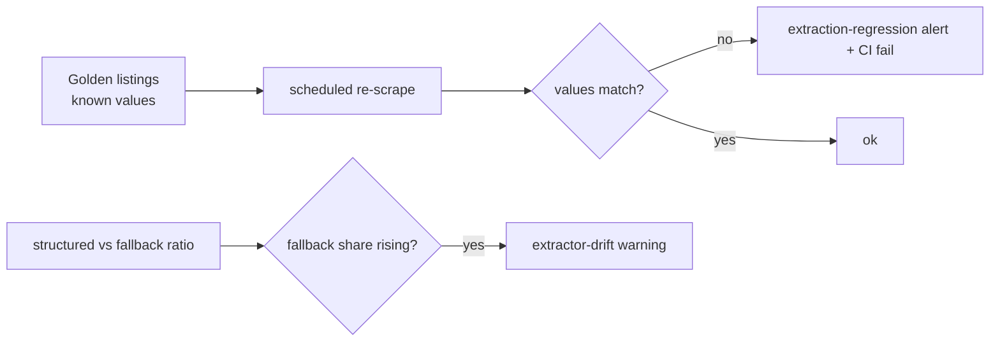
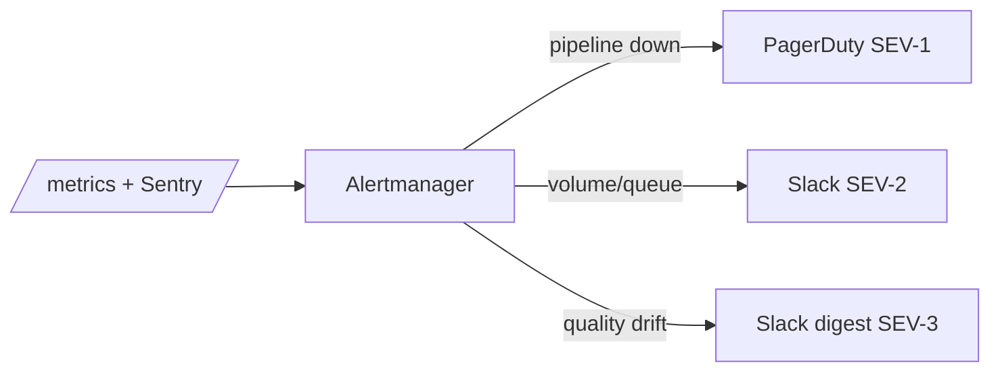

# Running this scraper in production

This document is the "Part 2" of the task: how I'd take the scraper in this repo from "works on my laptop against one page of London listings" to "runs unattended against hundreds of thousands of listings and I trust the data the next morning."

I've tried to write what I'd actually do, in the order I'd actually do it, rather than a catalogue of every monitoring tool that exists. Where the repo already implements something, I say so — a lot of the production story is real here, not hypothetical.

---

## 0. The shape of the system

The scraper is deliberately split into a **producer** (crawl search pages, discover listing URLs) and a **consumer** (fetch one listing, extract, store). They talk through a queue. That single decision is what makes most of the production story possible — scaling, retries, rate limiting and back-pressure all fall out of it.

Everything below builds on this picture.

---

## 1. Scaling to hundreds of thousands of listings

The work is already queue-based, so scaling is mostly an operational exercise rather than a rewrite.

**Horizontal workers.** `scrape-listing` is the expensive step (a Playwright fetch per listing). Because each job is independent and stateless, I scale by running more worker replicas — on ECS/Kubernetes I'd autoscale the listing-worker deployment off **queue depth** (e.g. keep depth-per-worker under a target). The crawl workers stay few; the listing workers are the fleet.

**Shard the crawl, don't widen it.** A single "all of the UK" crawl is fragile and unobservable. I'd shard by **outcode / region** (the schema already stores `outcode`) and enqueue one crawl per shard. That gives parallelism, isolates failures ("Manchester crawl is broken" instead of "the crawl is broken"), and lets me set per-region cadence (hot markets more often).

**Crawl incrementally.** At 100k+ listings you cannot re-fetch everything every cycle. The cheap signals first:
- Use the portal **sitemaps** and the search result ordering ("recently added/updated") to find what's *changed* and only deep-scrape those.
- Keep a cheap "seen set" of `(portalListingId, price, lastSeenAt)`; only spend a Playwright fetch when something looks new or moved.
- Re-validate the long tail on a slow rotation (e.g. every listing at least once a week) to catch sold/removed.

**Cost control on the fetch.** Playwright is correct for robustness but heavy. For OnTheMarket specifically the data lives in the page's embedded JSON (`__NEXT_DATA__` → Redux state), which a plain HTTP GET already returns — so a production optimisation is **HTTP-first, Playwright-on-fallback**: try a cheap `fetch`, and only spin up a browser when the cheap path is blocked or the JSON is missing. The adapter is already written so the *extraction* is identical either way.

**Data layer.** `price_history` is the table that grows without bound, so I'd **partition it by month** and put a retention/rollup policy on old partitions. Reads stay fast because the dashboard only ever wants "history for one property" (covered by the `(propertyId, recordedAt)` index) or "recent changes" (a recent partition). Upserts get batched per worker.

---

## 2. Tracking price changes over time

This is implemented in the repo, and it's deliberately boring — boring is what you want for the thing that has to be correct.

On every scrape the listing worker upserts the property, then compares the new asking price to the stored one and **only writes a `price_history` row when the price actually changed** (`INITIAL` on first sight, `INCREASE`/`DECREASE` thereafter). No change → no row. That keeps the table small and makes "show me price drops this week" a trivial query.

The decision lives in one pure function (`priceChangeType`) with unit tests, so the rule is testable in isolation from the database. The dashboard renders the resulting series as a line chart on each listing.

> Verified live: I lowered a stored price by hand and re-ran the scrape; the run reported `priceChanges=1` and a new `INCREASE` row appeared for exactly that one listing while the other 27 were untouched.

---

## 3. Detecting that the scraper has silently stopped

The failure I worry about most isn't a crash — a crash pages you. It's the scraper **succeeding at doing nothing**: still running, still "green", quietly returning zero listings because a URL shape changed. So I monitor outcomes, not process liveness.

Three layers, cheapest first:

1. **Heartbeat / dead-man's switch.** Every run writes a `ScrapeRun` row with `startedAt`/`finishedAt`/`status`. `GET /health/pipeline` exposes "minutes since the last *successful* run." A dead-man's-switch (Healthchecks.io / Cronitor / a Prometheus `absent()` alert) fires if no success lands inside the expected window. This catches "the whole thing stopped."
2. **Volume thresholds.** A run that finishes `SUCCESS` with `listingsFound` far below the rolling norm is the silent failure. Alert on `listingsFound < 50% of the trailing 7-run median`. This is the one that catches "it's running but finding nothing."
3. **Queue health.** If `scrape-listing` depth climbs monotonically, or jobs are aging, workers are wedged — alert on queue depth and oldest-job-age.

---

## 4. Identifying silent data-quality issues

"Silent" is the key word: the scrape succeeds, rows are written, but a field is quietly wrong or empty because one selector broke while the rest held.

What's implemented: every run records a **`FieldQualitySnapshot`** per tracked field — `nullCount / totalCount / nullRate` for address, price, type, bedrooms, description, agent and images. The dashboard renders these as completeness bars, and `/metrics` exports them as `ukps_field_null_rate{field=...}`.

On top of that baseline I'd add:
- **Schema validation at write time** (already there, via Zod): a listing missing its id/url/address is rejected and counted as an error rather than written as junk. Sanity bounds reject the absurd (a £1 price, 99 bedrooms) — those are usually extraction bugs, not real data.
- **Drift alerts**, not fixed thresholds. The signal isn't "agentName is 5% null" — some listings genuinely lack one — it's "agentName *jumped* from 2% to 60% null between runs." Alert on the *delta* against a rolling baseline. A single field spiking is the fingerprint of a broken selector.
- **Distribution checks** for the fields that don't go null but go wrong: median price, price histogram shape, bedroom distribution. If today's median price is 10x yesterday's, something is parsing "£550,000" as 550000000.

---

## 5. Monitoring extraction accuracy

Completeness (section 4) tells me a field is *present*; accuracy tells me it's *right*. A selector can grab the wrong element and cheerfully fill the field with a wrong value — null-rate stays at 0%, everything looks fine.

- **Golden set.** Keep ~30–50 hand-verified listings with known-correct values committed to the repo (this project already ships the two real OnTheMarket pages as test fixtures, asserted field-by-field — that's the seed of a golden set). Re-scrape them on a schedule and **diff against the known-good values**. Any mismatch is a regression, caught before it touches the live dataset. These run in CI too, so a code change that breaks extraction fails the build.
- **Canaries.** A handful of stable, long-lived listings re-scraped frequently; alert the moment their extracted values change unexpectedly.
- **Source-of-truth flag.** The adapter records whether each listing came from the **structured** path (`__NEXT_DATA__`) or the **fallback** path (OG meta tags). A rising share of `fallback` means the structured extractor has drifted and is silently degrading — a leading indicator that fires *before* fields actually go null. I'd export that ratio as a metric and alert on it.

---

## 6. Alerting when something breaks

Principle: **alert on symptoms the user feels, route by severity, and make every alert actionable.** An alert with no runbook is just anxiety.

- **Exceptions →** Sentry (crashes, unhandled rejections, Playwright timeouts). Good for "a developer needs to look," not for paging.
- **Metrics →** Prometheus scrapes `/metrics`; Grafana dashboards; Alertmanager owns routing. The rules map straight onto the sections above.
- **Routing.**

| Severity | Example | Channel |
|---|---|---|
| **SEV-1 page** | No successful run in the expected window (pipeline down) | PagerDuty |
| **SEV-2 alert** | `listingsFound` < 50% of median; queue backing up | Slack `#scraper-alerts` |
| **SEV-3 warn** | One field's null-rate spiked; `fallback` ratio rising | Slack, daily digest |

Each rule links a one-line runbook: what it means, where to look (`/health/pipeline`, the run's field-quality, recent deploys), and the usual cause (95% of the time: the portal changed its markup → check the `fallback` ratio and re-tune the adapter).

---

## Bonus: rate limiting, CAPTCHAs, dynamic JS, anti-bot

**Rate limiting.** The listing worker uses a BullMQ rate limiter (`max` jobs / `duration`, from env) plus randomised per-request jitter, so throughput is polite and predictable rather than a thundering herd. Per-domain limits scale with the proxy pool, not the worker count.

**Dynamic JavaScript.** Handled by Playwright — it renders the page so client-hydrated content is available. For OnTheMarket the useful data is in the server-sent `__NEXT_DATA__`, so rendering is belt-and-braces; for portals that build the DOM client-side it's essential.

**Anti-bot.** The browser service already sets a realistic UA, viewport, `en-GB` locale and timezone, disables the automation flag, and detects block/challenge pages (Cloudflare/PerimeterX signatures, suspiciously empty bodies) — throwing a `BlockedError` so the job retries with backoff instead of saving a CAPTCHA page as a "listing." In production I'd add **residential proxy rotation** (the service already takes a proxy via env), rotate fingerprints, and keep concurrency modest per IP.

**CAPTCHAs.** Detection is in place; the response is to **back off, rotate IP, and retry** rather than hammer. A solver service can be plugged in behind the same `BlockedError` path, but I'd treat a rising CAPTCHA rate as a signal to slow down, not as something to brute-force — getting the whole IP range banned is the more expensive failure.

**And the boring-but-important one:** respect `robots.txt` and the portal's terms, scrape only public listing data, cache aggressively, and keep request rates considerate. The cheapest way to keep a scraper healthy in production is to not be worth blocking.
